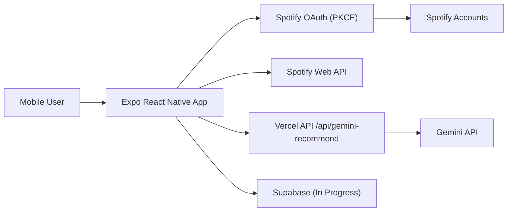

# Moodtune


Spotify 취향 데이터 + 사용자 자연어 입력을 결합해 개인화 플레이리스트를 생성하는 **모바일 앱 중심 프로젝트**입니다.

## 0. 👀 Hiring Manager Quick View

| 항목 | 핵심 요약 |
|---|---|
| 내가 한 일 | 기획, UX 설계, 디자인 방향, 프론트엔드 구현, API 연동, 배포/보안 개선까지 1인 end-to-end 수행 |
| 문제 해결 | 자연어 기반 큐레이션 + Spotify 취향 동기화 + 생성 실패 대비 fallback까지 포함한 실사용 흐름 구축 |
| 기술 역량 | React Native/Expo, OAuth, 외부 API 안정화(401/403/429), 서버리스 프록시, 보안 가드레일 |
| AI 활용 | 개발 속도 가속 + 타입/예외/보안 검증까지 결합해 품질과 생산성 동시 개선 |
| 현재 상태 | 완료형이 아니라 **현재 개발 진행형**. MVP 동작 중, 품질/정확도/운영 자동화 고도화 진행 중 |

---

## 1. 🚧 현재 상태 (진행형)

- 본 프로젝트는 **현재 개발 진행 중**입니다.
- 데스크탑 웹 서비스가 목적이 아니며, **모바일 앱 UX 기준으로 설계**되었습니다.
- 웹 빌드는 모바일 UI 검증/운영 보조 채널입니다.

배포 주소:
- Production: `https://moodtune-web.vercel.app`
- Deploy Preview: `https://moodtune-34jpxz6zs-devkdys-projects.vercel.app`

---

## 2. 🧑‍💻 역할과 오너십 (1인 프로젝트)

- 요구사항 정의 및 기능 우선순위 수립
- UX 플로우/화면 구조 설계
- UI 구현(React Native + Expo)
- Spotify OAuth 및 Web API 연동
- Gemini 연동 및 프롬프트/결과 파이프라인 구현
- 상태관리/에러복구/로그 마스킹 등 운영 품질 개선
- 배포 구성(Vercel) 및 환경변수/보안 정책 정리

---

## 3. 🛠️ 기술 스택 (Recruiter-Friendly Order)

### Core Product Stack


### Product Integrations


### Infra / State


요약:
- App: `React Native + Expo` (Mobile First)
- State: `Zustand`
- Auth: `Spotify OAuth 2.0` (`expo-auth-session`)
- AI: `Google Gemini API`
- Infra: `Vercel`, `Supabase`

---

## 4. 🎯 제품 목표 및 가치

- **Hyper-Personalization**
  - Spotify Top Tracks/Artists/Recent + 현재 무드 결합
- **구체적 자연어 요청 수용**
  - "1시간 이상", "최신곡", "특정 시기/분위기" 같은 복합 요구 해석
- **비용 효율적 MVP 설계**
  - Gemini/Spotify/Supabase free tier 중심 아키텍처

---

## 5. 🧩 핵심 기능

1. 자연어 기반 AI 큐레이션
2. Spotify 취향 동기화 (`user-top-read`)
3. 스마트 검색/매칭 로직
4. 플레이리스트 자동 생성 및 Spotify 저장
5. 생성 실패/쿼터 초과 시 Spotify 기반 fallback

예시 입력:
- "오늘 비 오는데 출근길에 둠칫거릴 노래 최신곡으로 1시간 분량 짜줘."

---

## 6. 🔄 사용자 플로우

1. Spotify 로그인/권한 승인
2. 자유 문장 입력
3. Gemini 분석(무드, 시간, 시기, 키워드)
4. Spotify 데이터와 결합한 리스트 생성
5. 검토 후 Spotify로 저장

---

## 7. 🏗️ 시스템 아키텍처

- Frontend: React Native (Expo)
- AI Layer: Gemini API
- Backend/API Proxy: Vercel Serverless (`/api/gemini-recommend`)
- Data/BaaS: Supabase (연동 확장 진행 중)
- External API: Spotify Web API



---

## 8. 🤖 AI 활용 방식 (속도 + 품질)

AI를 자동완성 수준으로 쓰지 않고, 개발 파트너로 활용했습니다.

- 속도 향상
  - 반복 UI/상태 연결 코드 가속
  - API 연동/예외 처리 구현 시간 단축
- 품질 강화
  - 타입 오류 조기 수렴
  - fallback/예외 흐름 정제
  - 구조 리팩터링 보조
- 보안 개선
  - 공개 비밀 제거
  - 민감 로그/에러 메시지 마스킹
  - 프록시 접근 제어(Origin allowlist) 정비

---

## 9. 🔒 보안/신뢰성 설계 포인트

- `.env*` Git 추적 차단
- 서버 전용 키 분리 (`GEMINI_API_KEY`)
- `GEMINI_PROXY_ALLOWED_ORIGINS` 기반 요청 제한
- 민감 payload 로깅 최소화
- Spotify API 401/403/429 대응(재시도/복구/fallback)

---

## 10. 🧪 MVP 범위와 확장 계획

MVP:
- Spotify 인증 + 취향 읽기
- 단일 문장 기반 AI 추천
- Spotify 플레이리스트 생성/저장

Phase 2 (진행 예정):
- 재생시간 정밀 매칭
- 이미지 기반 분위기 해석
- 취향 가중치 슬라이더(내 취향 vs 새로운 곡)

진행 상태:
- ✅ 핵심 사용자 흐름(MVP) 동작
- 🔄 품질/정확도/운영 자동화 고도화 진행 중

---

## 11. ▶️ 실행 방법

```bash
npm install
npm run start
```

웹 검증:
```bash
npm run web
```

필수 환경변수:
- `EXPO_PUBLIC_SPOTIFY_CLIENT_ID`
- `EXPO_PUBLIC_GEMINI_PROXY_URL` (native에서 필요)
- `EXPO_PUBLIC_SUPABASE_URL`
- `EXPO_PUBLIC_SUPABASE_ANON_KEY`
- `GEMINI_API_KEY` (server)
- `GEMINI_PROXY_ALLOWED_ORIGINS` (server)

---

## 12. 🎨 기획/디자인 출처

- Figma: `https://www.figma.com/design/wvZVU9dtHnCarni9ufAoj7/MoodTune?node-id=0-1&t=nbdRjNiQDfvjac4s-1`

---

### 📣 Portfolio Summary

Moodtune는 아이디어 수준이 아니라,
기획 → UX → 구현 → 배포 → 보안 개선까지 1인이 완주한 모바일 제품형 프로젝트입니다.
AI 활용으로 리드타임을 줄이면서도 운영 가능한 품질 기준(신뢰성/보안/복구)을 함께 달성하는 데 집중했습니다.

---

Last Updated: 2026-03-19
